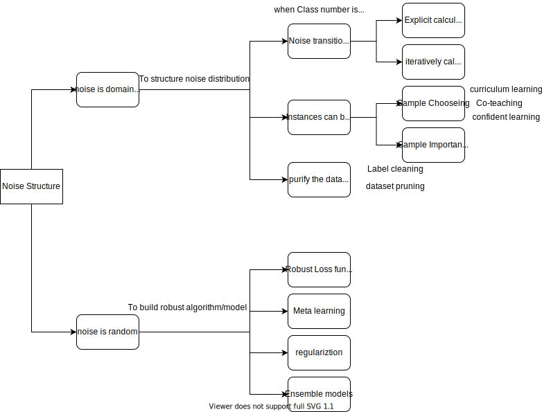

# Learning With noisy labels
Designing supervised learning algorithms that can learn from data sets with noisy labels is a problem of great practical importance. This Blog I will give you a brief introduciton and worldview of this research area.

# 1. Context
Deep learning has several principle problems: 
- 1) deep learning requires a lot of data training 
- 2) do not have enough ability to migrate 
- 3) open inference problem 
- 4) principle is not transparent deep learning heavily relies on high quality annotation data, resulting in high time, labor cost; 
so, how to achieve semi-supervised, unsupervised learning is a very important problem.

The Learning with noisy labels situation is as follows:

- 1) In the initial phase, it has a certain amount of data of unknown annotation quality. There is a certain annotation data, which can be obtained through the search engine, the public dataset.
- 2) The annotation data is of low quality — with high or low annotation errors
- 3) it requires continuous manual input to constantly improve the quality of annotation. The form of human annotation may be with paid crowdsourcing, or with user feedback.

# 2. Survey
Before I introduce the research survey to you, I wrote a brief overview based on my view.

All of approaches in this area is to solve one problem: how to classify noisy data and clean data. And I classify all the approaches as two part as the following figure: one is to try to sturcture the noise distribution in dataset, the other is to build robust algorithm and model no matter what noise distribution. 

</img>

And Then I will give some important surveys, not a long list:
- Label Noise Types and Their Effects on Deep Learning
- Image Classification with Deep Learning in the Presence of Noisy Labels: A Survey
- Learning from Noisy Labels with Deep Neural Networks

# 3. Paper List
## EM Algorithm
- Training deep neural-networks using a noise adaptation layer (ICLR 2017) [[Code_1]](https://github.com/udibr/noisy_labels) [[Code_2]](https://github.com/Billy1900/Noise-Adaption-Layer) [[Blog]](https://blog.csdn.net/weixin_42051034/article/details/106809500)

## Confident Learning
- Confident Learning: Estimating Uncertainty in Dataset Labels (ICML 2019) [[Code]](https://github.com/cgnorthcutt/cleanlab) [[Blog]](https://l7.curtisnorthcutt.com/confident-learning)

## Sample Weighting
- Beyond Synthetic Noise: Deep Learning on Controlled Noisy Labels (ICML 2020)--MentorMix [[Code]](http://www.lujiang.info/cnlw.html) [[Video]](https://www.youtube.com/watch?v=xcPyu_N-mEU) [[Blog]](https://zhuanlan.zhihu.com/p/195637841)

## Curriculum Learning
- MentorNet: Learning data-driven curriculum for very deep neural networks on corrupted labels (ICML 2018) [[Code]](https://github.com/google/mentornet) [[Video]](https://vimeo.com/287807927) [[Blog]](https://blog.csdn.net/qq_25011449/article/details/81560353)
- DivideMix: Learning with noisy labels as semi-supervised learning (ICLR 2020) [[Code]]( https://github.com/LiJunnan1992/DivideMix) [[Blog]](https://zhuanlan.zhihu.com/p/174803527)

## Co-teaching
- Co-teaching: Robust Training of Deep Neural Networks with Extremely Noisy Labels (NIPS 2018) [[Code]](https://github.com/bhanML/Co-teaching?utm_source=catalyzex.com)

## Robust loss function
- Symmetric Cross Entropy for Robust Learning with Noisy Labels (ICCV 2019) [[Code]](https://github.com/xingjunm/dimensionality-driven-learning)

## Regularization
- Early-Learning Regularization Prevents Memorization of Noisy Labels (NeurIPS 2020) [[Code]](https://github.com/shengliu66/ELR)

## Label Cleaning
- SELFIE: Refurbishing unclean samples for robust deep learning (ICML 2019) [[Code]](https://github.com/kaist-dmlab/SELFIE)

# 4. Supplementary
- [Noisy-Labels-Problem-Collection](https://github.com/GuokaiLiu/Noisy-Labels-Problem-Collection)
- [Learning-with-Label-Noise](https://github.com/subeeshvasu/Awesome-Learning-with-Label-Noise#github)
- [Deep Learning with Label Noise / Noisy Labels](https://github.com/gorkemalgan/deep_learning_with_noisy_labels_literature)
